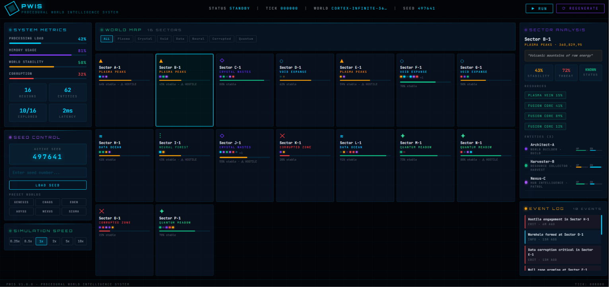
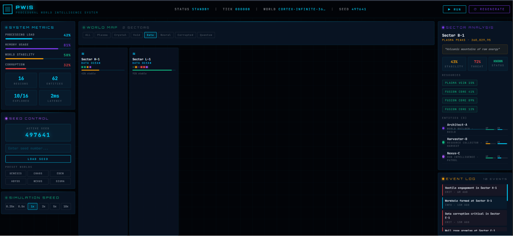
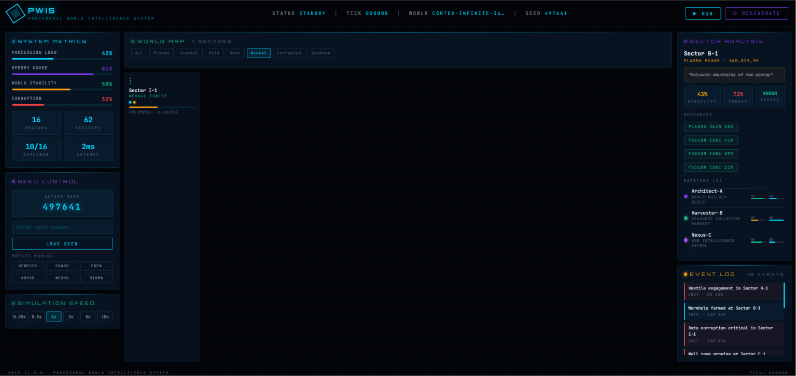
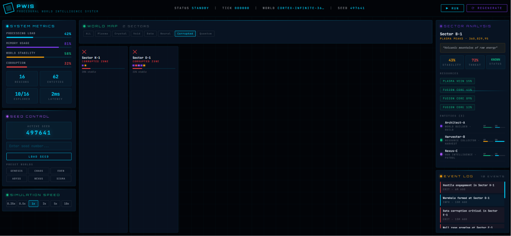
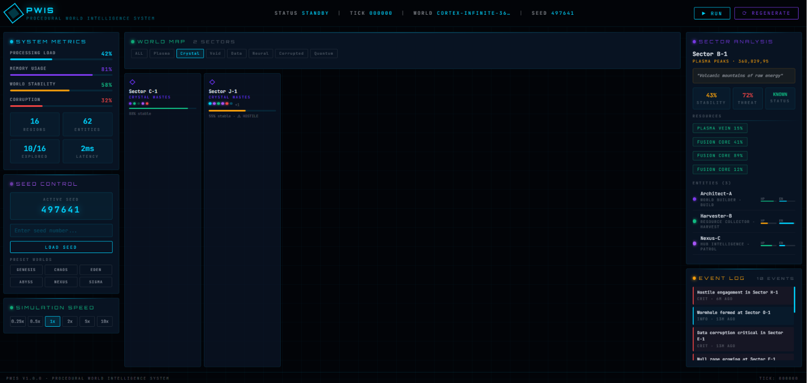

# 🌐 Procedural World Intelligence System (PWIS)

> An advanced AI-powered procedural world generation and real-time intelligence simulation system built with React, Vite, Three.js, and Framer Motion.
 <div align="center">

<br/><br/>

<br/><br/>

<br/><br/>

<br/><br/>

</div>
---

## ✨ Features

- **Procedural World Generation** — Seeded RNG generates unique worlds with regions, biomes, entities, and resources
- **7 Unique Biomes** — Void Expanse, Neural Forest, Crystal Wastes, Data Ocean, Plasma Peaks, Quantum Meadow, Corrupted Zone
- **6 Entity Types** — Sentinel, Harvester, Architect, Predator, Oracle, Nexus — each with unique behaviors
- **Real-time Simulation** — Tick-based simulation with adjustable speed (0.25× to 10×)
- **Event System** — Dynamic world events with severity levels (Critical / Alert / Warning / Info / Success)
- **Interactive World Map** — Filter by biome, click to inspect sectors
- **Seed Control** — Enter any seed or choose from presets to recreate worlds
- **System Metrics** — Live monitoring of processing load, memory usage, stability, and corruption level
- **Cyberpunk UI** — Orbitron + JetBrains Mono fonts, scan lines, glow effects, animated indicators

---

## 🚀 Quick Start

### Prerequisites

- **Node.js** ≥ 20.19 or ≥ 22.12
- **npm** ≥ 9

### Install & Run

```bash
# Clone the repository
git clone https://github.com/YOUR_USERNAME/Procedural-World-Intelligence-System.git
cd Procedural-World-Intelligence-System

# Install dependencies
npm install

# Start development server
npm run dev
```

The app will open at **http://localhost:5173** automatically.

### Build for Production

```bash
npm run build
npm run preview
```

---

## 🗂 Project Structure

```
procedural-world-intelligence-system/
├── public/
│   └── favicon.svg               # App icon
├── src/
│   ├── components/
│   │   ├── Header.jsx            # Top navigation bar
│   │   ├── StatsPanel.jsx        # System metrics panel
│   │   ├── WorldMap.jsx          # Interactive region grid
│   │   ├── RegionDetail.jsx      # Selected sector analysis
│   │   ├── EventLog.jsx          # Live world event feed
│   │   ├── SeedControl.jsx       # Seed input + presets
│   │   └── SpeedControl.jsx      # Simulation speed selector
│   ├── hooks/
│   │   └── useWorldSimulation.js # Core simulation loop hook
│   ├── utils/
│   │   └── worldGen.js           # Procedural generation engine
│   ├── App.jsx                   # Root component / layout
│   ├── main.jsx                  # React entry point
│   └── index.css                 # Global styles + Tailwind
├── index.html                    # HTML entry point
├── vite.config.js                # Vite configuration
├── tailwind.config.js            # Tailwind CSS configuration
├── postcss.config.js             # PostCSS configuration
├── package.json                  # Dependencies
└── README.md                     # This file
```

---

## 🌍 Biomes

| Biome | Accent | Temperature | Description |
|---|---|---|---|
| Void Expanse | `#00d4ff` | −273°C | Primordial emptiness between realities |
| Neural Forest | `#10b981` | 22°C | Dense network of living data pathways |
| Crystal Wastes | `#7c3aed` | −40°C | Frozen fields of computational mineral |
| Data Ocean | `#00d4ff` | 4°C | Infinite sea of unprocessed information |
| Plasma Peaks | `#f59e0b` | 5000°C | Volcanic mountains of raw energy |
| Quantum Meadow | `#34d399` | 18°C | Fields where reality exists in superposition |
| Corrupted Zone | `#ef4444` | 0°C | Regions where the simulation has broken down |

---

## 🤖 Entity Types

| Entity | Role | Intelligence | Speed | Aggression |
|---|---|---|---|---|
| Sentinel | Guardian | 0.80 | 0.60 | 0.20 |
| Harvester | Resource Collector | 0.50 | 0.40 | 0.10 |
| Architect | World Builder | 0.95 | 0.30 | 0.00 |
| Predator | Apex Hunter | 0.70 | 0.90 | 0.90 |
| Oracle | Prediction Engine | 1.00 | 0.10 | 0.00 |
| Nexus | Hub Intelligence | 0.90 | 0.20 | 0.10 |

---

## 🎮 How to Use

1. **Generate a World** — Click `⟳ REGENERATE` or enter a custom seed number
2. **Run the Simulation** — Click `▶ RUN` to start the live tick simulation
3. **Adjust Speed** — Use the speed control panel (0.25× to 10×)
4. **Explore Sectors** — Click any sector card in the world map to view detailed information
5. **Filter by Biome** — Use the biome filter buttons above the map
6. **Use Preset Worlds** — Click preset buttons like `GENESIS`, `CHAOS`, `EDEN` for curated worlds
7. **Monitor Events** — Watch the event log for world events in real-time

---

## 🛠 Tech Stack

| Technology | Version | Purpose |
|---|---|---|
| React | 18.3.1 | UI framework |
| Vite | 8.0.x | Build tool & dev server |
| Framer Motion | 11.x | Animations |
| Tailwind CSS | 3.4.x | Utility-first CSS |
| Three.js | 0.160.x | 3D graphics (available for extensions) |
| Axios | 1.6.x | HTTP client (available for API extensions) |

---

## 🔧 Configuration

### Vite (`vite.config.js`)
- Dev server runs on port **5173**
- Auto-opens browser on start

### Tailwind (`tailwind.config.js`)
- Custom color palette: `void`, `neural`, `pulse`, `synapse`, `data`, `warn`, `danger`
- Custom fonts: `Orbitron` (display), `JetBrains Mono` (mono)
- Custom animations: `pulse-slow`, `spin-slow`, `scan`, `flicker`

---

## 📦 Deployment

### Vercel
```bash
npm i -g vercel
vercel
```

### Netlify
```bash
npm run build
# Drag and drop /dist folder to Netlify
```

### GitHub Pages
```bash
npm run build
# Deploy /dist to gh-pages branch
```

---

## 🤝 Contributing

1. Fork the repository
2. Create a feature branch: `git checkout -b feature/your-feature`
3. Commit your changes: `git commit -m 'Add your feature'`
4. Push to the branch: `git push origin feature/your-feature`
5. Open a Pull Request

---

## 📄 License

MIT License — see [LICENSE](LICENSE) for details.

---

## 🌟 Roadmap

- [ ] 3D world visualization using Three.js
- [ ] Entity pathfinding and AI behavior trees
- [ ] Multi-world portal system
- [ ] Save/load world states to localStorage
- [ ] Multiplayer simulation via WebSockets
- [ ] AI-generated world lore using Claude API

---

*Built with ❤️ and procedural chaos.*
